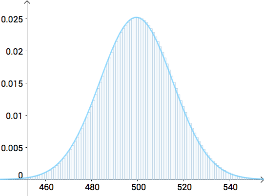
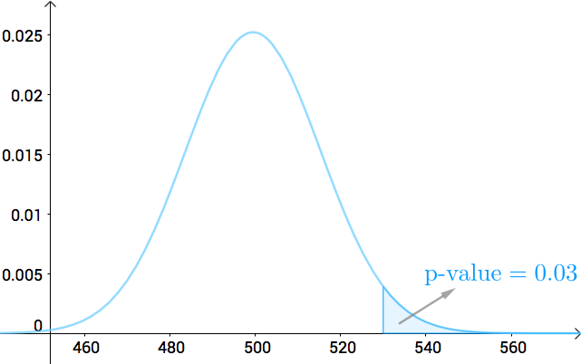

首先要说明的是，这是两套不同的体系，并且相互诋毁不互相认，而现今的教科书和实践中，已经把这些概念混淆起来了，想必这是两套体系的发明者不愿意看到的状况。
# 显著性检验
由[Ronald Fisher](https://en.wikipedia.org/wiki/Ronald_Fisher)首先提出，具体过程如下：


1.有一个命题，称之为”零假设“（null hypothesis）$H_0$

```
比如，你有一个硬币，你假设它是均匀的，这就是所谓的零假设
```

2.找到一个统计量 $T$，可以计算$T$的统计分布

```
这里我们扔 N 次硬币，统计硬币正面朝上的次数，服从二项分布
如果N足够大，那么二项分布一个很好的近似是正态分布
```

3.通过实验可以计算得到一个确切的$T$值（$T_0$），在$H_0$成立的情况下，出现比$T_0$更极端情况的概率值记作 $p$ 值
```
这里我们扔1000次硬币，如果硬币均匀（即零假设成立），硬币朝上的次数的分布如下图所示（这里用正态分布来近似二项分布）

```
 

```
假如我们扔了1000次，得到530次正面，那么这里的p值就是指：如果硬币均匀，扔1000次，正面的次数在530以上（即出现该结果或更极端的情况）的概率，如下图阴影部分所示
```
 

4.如果$p$很小，则可以作为”零假设并不成立“的有力证据。


注意，在Fisher的这套体系里面不涉及备择假设$H_a$（alternative hypothesis）。

# 假设检验
由E. Pearson和J. Neyman在1928年发表在《生物计量》杂志上的[文章](https://psycnet.apa.org/record/1929-03879-001)中提出的概念，他们建立了与Pearson简单的p值系统不同的一套称作“假设检验”的理论体系。

$H_0$为真而拒绝的错误，称作I类错误，又称为弃真错误、假阳性（false positive），和检验的显著水平（significance level），记作${\alpha}$

$H_0$为假$H_a$为真而没能拒绝$H_0$的错误，称作II类错误，又称存伪错误、假阴性（false negative）